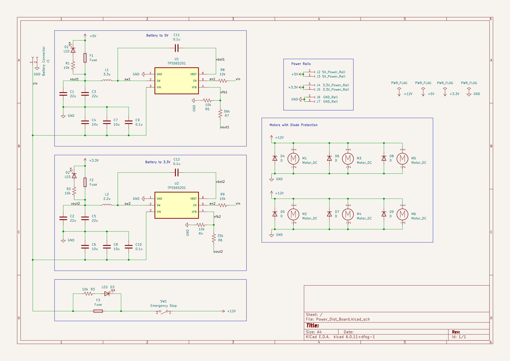
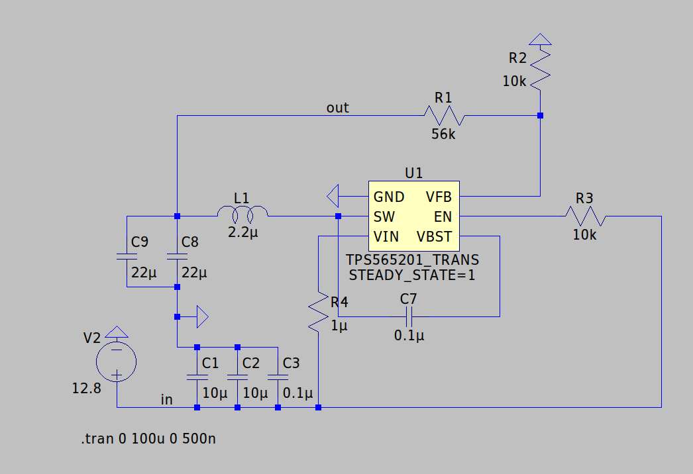
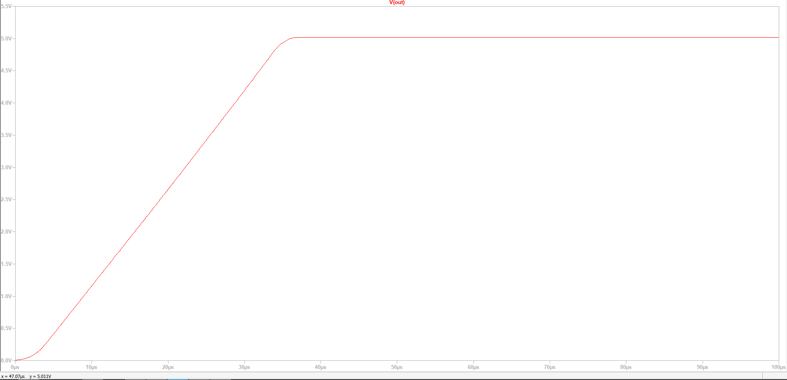
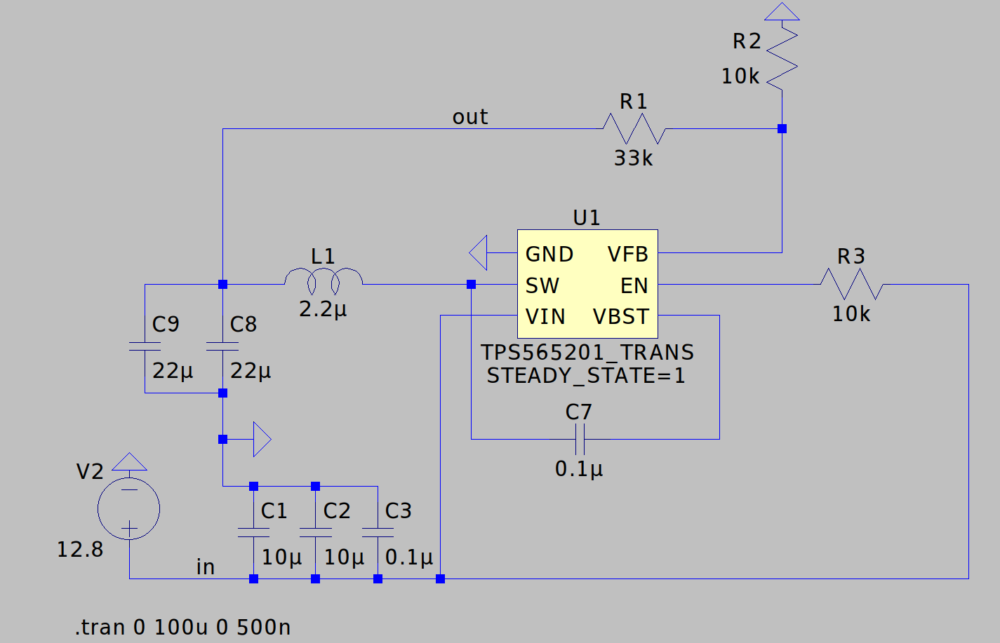
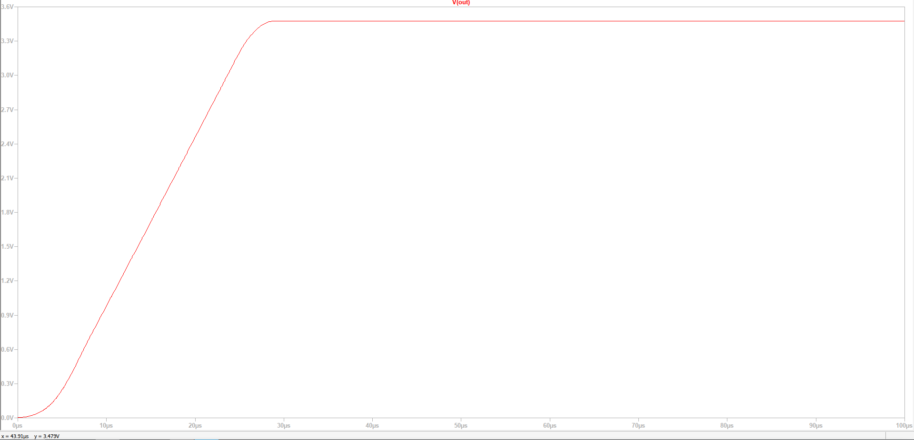

# Power Distribution Signoff

## Functionality

The primary functionality of the power distribution system is to reliably supply power to all of the components of the robot. The power distribution system can supply power through 3.3 V, 5 V, and 12 V rails, with the 12 V rails being dedicated for motor use.

## Constraints

### Derived from Shall Statements

- The power distribution system must be able to supply enough current and power to all other subsystems on the robot for their proper functionality.
	+ This constraint was made because the purpose of the power distribution system is to provide adequate power the entire robot. Because of this, the other subsystems constrain the power distribution subsystem and this constraint is the most important to this subsystem.
- C4: The robot shall contain modules that are plug-and-play
adaptable for different IEEE competition requirements.
	+ This constraint is applicable to all subsystems of the robot platform in order to make the robot easily adaptable year to year. This in particular applies to the power distribution system by requiring that power connections should be easy to connect and disconnect.
- C7:  The robot shall possess a single emergency stop button
that is accessible and stops all robot movement without removing power to essential processors that is compliant with standard NFPA 79-10 [NFPA79].
	+ The constraint is required by the IEEE hardware competition rules every year as a safety precaution and is followed by the power distribution system of the robot [IEEE].
- C8: The robot shall contain a power bus that is not inhibited by DC motor operation.
	+ This constraint was made because DC motors can cause interference in the power buses of electronics by supplying a voltage pushing back on their power source, referred to as "back-EMF", inhibiting the function of the power rails for other components. Diode protection is used to prevent this.

### Derived from Broader Implications

- C17: This standard outlines the allowable ampacities of insulated conductors up to 2000 volts. The project will be well under this voltage and is therefore applicable. The standard will need to be followed for the safety of the design team and potential users by ensuring all wire is appropriately rated for the load [NFPAamp].
	+ This constraint is applicable because it outlines the allowable ampacities of insulated conductors up to 2000 Volts. The voltages used in the power distribution system will fall under this limit and so this standard is an applicable constraint of the system.

## Schematic

The schematic for the power distribution circuit board is shown above. The board has a screw terminal connector meant for connecting to the battery. This then supplies the input voltage to the three power rail subcircuits. 

The circuit board is based around a single type of buck converter chip, the TPS565201. This chip is a variable voltage regulator buck converter that can source up to 5 A of output current [TPS565]. The output voltage is set by the ratio of feedback resistors connected to the the VFB pin of the chip. 

There are two buck converter-based subcircuits on the board, one for the 3.3 V and one for the 5 V rail. The feedback resistors are R5, R7, R4, and R6, which set output voltages of 5 V and 3.3 V, respectively.

The other component values were chosen based on the recommended values given by the manufacturer, Texas Instruments [TPS565]. These values can be found in Table 2. Recommended Component Values of the datasheet.

There is a 12 V rail specifically designed for supplying power to the motors. Because the motors and their drivers are much less sensitive to slight variations in supply voltage, no voltage regulators are used. Additionally, there are reverse-biased diodes for back-emf protection.

Finally, the circuit design has fuses on each of the power rails to protect the conductors from over-current protection.

## Analysis

To ensure that the first constraint, that the power distribution system can supply adequate power and current to the other subsystems, is met the following analysis was done.

The current requirements were a very large constraint of the subsystem. The current requirements of each power rail are shown below.

#### 5 V Rail Current Requirements [QTR-8RC][SKU 1010][JetsonNano]
| Item | Part Number | Quantity | Max Current Draw (mA) | Item Current (mA) |
| --- | --- | --- | --- | --- |
| Line Sensor | Pololu QTR-8RC | 1 | 100 | 100 |
| Ultrasonic Distance Sensor | SKU 101020010 | 4 | 8 | 32 |
| Jetson Nano\* | SKU 101020010 | 1 | 2000 | 2000 |
| Total Current |  |  |  | 2132 |

\*The Jetson Nano current requirements depend on the supply method chosen. The Micro-USB connection was chosen in this case.

#### 3.3 V Rail Current Requirements [sources]
| Item | Part Number | Quantity | Max Current Draw (mA) | Item Current (mA) |
| --- | --- | --- | --- | --- |
| Compass| LIS3MDL | 1 | 0.27 | 0.27 |
| Accelerometer | ADXL345 | 1 | 0.14 | 0.14 |
| Total Current |  |  |  | 0.41 |

#### 12 V Rail Current Requirements [sources]

| Item | Part Number | Quantity | Max Current Draw (mA) | Item Current (mA) |
| --- | --- | --- | --- | --- |
| Motor | Metal Gearmotor 37Dx73L mm 12V | 4 | 720 | 2880 |
| Motor Driver | L298N Motor Drive Controller Board | 2 | 2000 | 4000 |
| Total Current |  |  |  | 6880 |

The subcircuits for each power rail must be able to supply the required current and more to allow for future expansions. The voltage regulator chips used for the 3.3 V and 5 V rails are the major current limiting factor for those power rails. The datasheet of the TPS565201 buck converter states that the chip can source a nominal output current of 5 A, with a maximum possible output current of 8 A. Using the nominal output current of 5 A, the 3.3 V and 5 V rails can source well over the required current. 

The 3.3 V rail can source an additional 1119% (4.59 A) of the current worst-case current draw, and the 5 V rail can source an additional 134% (2.87 A) of the current worst-case current.

After the chip itself, the output current is limited by the narrowest trace on the output line from the chip. In the case of this board the narrowest trace bottle-necking the output current is the trace immediately connected to the SW pin because it is limited by the space between the chip's pins. All other traces that the output current passes through are wider than this trace and so can support more current. The maximum possible width of the trace connected to the SW pin is 0.5 mm.

The IPC-2221 standard gives formulas and data to calculate the maximum current of this trace [IPC]. From Figure A and Figure B in Appendix B, the maximum current can be calculated based on the maximum required change in temperature. The maximum acceptable change in temperature can be found by looking at the transition temperature of the PCB laminate material FR4, the temperature at which the laminate will begin to degrade, and is around 110 degrees Celsius [NewCorr]. Because the transition temperature of FR4 is so much lower than the melting point of copper (1083 Celsius), the FR4 transition temperature is the upper bound on trace temperature to limit the current through the trace.

To find the maximum current of the trace, the cross section needs to be found, which requires the width and thickness of the trace. The width is limited to 0.5 mm. Thickness of PCB copper traces is often given in oz/ft^2, which is the weight in oz of the copper used in a trace if it were rolled into a square-foot area [copper]. To allow for higher current, 2 oz/ft^2 was chosen instead of the default option of 1 oz/ft^2. Using Figure B of Appendix B of the IPC-2221 standard after converting the trace width to inches, the cross section of the trace is about 50 square-mils.

To then find the maximum allowable current, Figure A is used [IPC]. Assuming that the trace begins at a room temperature of 25 Celsius and that the maximum allowable temperature is 110 Celsius, this yields a maximum change in temperature of 85 degrees Celsius. Using the graph, this yields a maximum current a little over 6 Amps. For more precise calculations, the FR4 source references earlier provides the formula for calculating max current in equation (1) [NewCorr]. When the aforementioned values are used in this formula, a maximum current of 6.28 A is calculated.

Because this current limit is higher than the output current limit of the voltage regulator chips, the trace will not fail within the normal operating parameters of the voltage regulator. To further prevent failures from occuring in the case of a sudden increase in current, a 6 A fuse is placed on the 3.3 V and 5 V rails near the output from the chip so that the fuse will blow before the trace can sustain any damage.

The four images below show the simulated results of the buck-converter subcircuits designed based on the recommended values given in the datasheet of the TPS565201 buck converter chip [TPS565]. The SPICE model used is provided by Texas Instruments on the website for the TPS565201 chip [TPSSPICE].

As can be seen above, the voltage regulator circuits successfully convert a 12.8 V input voltage, the nominal voltage of the battery chosen, down to 5 V and 3.3 V with minimal start-up delay [batteryds]. The datasheet for the TPS565201 states that the chip is able to source 5 A [TPS565201]. This means that the 3.3 V and 5 V power rails are both able to source up to 5 A of current. The 12 V rail does not have a voltage regulator, and so it current-limited by the fuse F3 in the schematic. 

The layout of the printed circuit board is shown below. The layout is very heavily based on the recommended layout given in the datasheet of the buck converters and can be found in Figure 30 in the datasheet [TPS565201]. The recommended layout was used to ensure the best possible thermal management and current capacity to avoid failures due to overheating or overcurrent. 

## BOM 

| Item | Part Number | Quantity | Price/Unit | Item Price |
| --- | --- | --- | --- | --- |
| Buck Converter | TPS565201  | 10 | $1.292   | $12.92 |
| Flyback Diode  | RB070MM    | 10 | $0.277   | $2.77  |
| LED            | QBLP615    | 20 | $0.289   | $5.78  |
| 6 Amp Fuse     | QBLP615    | 10 | $0.700   | $7.00  |
| 10 Amp Fuse    | QBLP615    | 10 | $0.312   | $3.12  |
| Screw Terminal | 0397730002 | 25 | $1.23880 | $30.97 |
| Female Headers | 5583       | 5  | $0.95    | $4.75  | 
| Emergency Stop Button | yyy | 2  | $xxx | $xxx |
| Printed Circuit Board |  | 5  | $xxx    | $xxx  |

## References

