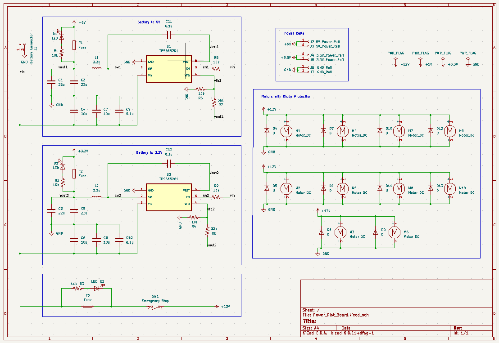
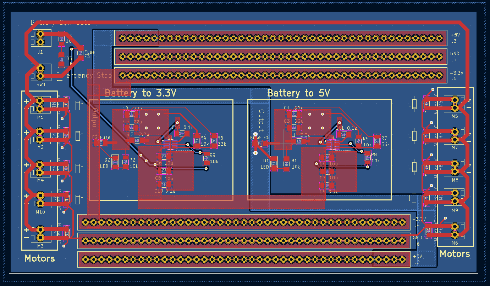

# Power Distribution Signoff

## Functionality

The primary functionality of the power distribution system is to reliably supply power to all of the components of the robot. The power distribution system can supply power through 3.3 V, 5 V, and 12 V rails, with the 12 V rails being dedicated for motor use.

## Constraints

### Derived from Shall Statements

- The power distribution system must be able to supply enough current and power to all other subsystems on the robot for their proper functionality.
	+ This constraint was made because the purpose of the power distribution system is to provide adequate power the entire robot. Because of this, the other subsystems constrain the power distribution subsystem and this constraint is the most important to this subsystem.
- C4: The robot shall contain modules that are plug-and-play
adaptable for different IEEE competition requirements.
	+ This constraint is applicable to all subsystems of the robot platform in order to make the robot easily adaptable year to year. This in particular applies to the power distribution system by requiring that power connections should be easy to connect and disconnect.
- C7:  The robot shall possess a single emergency stop button
that is accessible and stops all robot movement without removing power to essential processors that is compliant with standard NFPA 79-10 [1].
	+ The constraint is required by the IEEE hardware competition rules every year as a safety precaution and is followed by the power distribution system of the robot [2][3][4].
- C8: The robot shall contain a power bus that is not inhibited by DC motor operation.
	+ This constraint was made because DC motors can cause interference in the power buses of electronics by supplying a voltage pushing back on their power source, referred to as "back-EMF", inhibiting the function of the power rails for other components. Diode protection is used to prevent this.

### Derived from Broader Implications

- C17: This standard outlines the allowable ampacities of insulated conductors up to 2000 volts. The project will be well under this voltage and is therefore applicable. The standard will need to be followed for the safety of the design team and potential users by ensuring all wire is appropriately rated for the load [5].
	+ This constraint is applicable because it outlines the allowable ampacities of insulated conductors up to 2000 Volts. The voltages used in the power distribution system will fall under this limit and so this standard is an applicable constraint of the system.

## Schematic

The schematic for the power distribution circuit board is shown above. The board has a screw terminal connector meant for connecting to the battery. This then supplies the input voltage to the three power rail subcircuits. 

The circuit board is based around a single type of buck converter chip, the TPS565201. This chip is a variable voltage regulator buck converter that can source up to 5 A of output current [6]. The output voltage is set by the ratio of feedback resistors connected to the the VFB pin of the chip. 

There are two buck converter-based subcircuits on the board, one for the 3.3 V and one for the 5 V rail. The feedback resistors are R5, R7, R4, and R6, which set output voltages of 5 V and 3.3 V, respectively.

The other component values were chosen based on the recommended values given by the manufacturer, Texas Instruments [6]. These values can be found in Table 2 of the datasheet.

There is a 12 V rail specifically designed for supplying power to the motors. Because the motors and their drivers are much less sensitive to slight variations in supply voltage, no voltage regulators are used. Additionally, there are reverse-biased diodes for back-emf protection.

Finally, the circuit design has fuses on each of the power rails to protect the conductors from over-current protection.

## Analysis

Any components references in the analysis below can be found in the table in the section titled "BOM."

### Adequate Power Supply

To ensure that the first constraint is met, that the power distribution system can supply adequate power and current to the other subsystems, is met the following analysis was done.

The current requirements were a very large constraint of the subsystem. The current requirements of each power rail are shown below.

#### 5 V Rail Current Requirements [7][8][9]
| Item | Part Number | Quantity | Max Current Draw (mA) | Item Current (mA) |
| --- | --- | --- | --- | --- |
| Line Sensor | Pololu QTR-8RC | 1 | 100 | 100 |
| Ultrasonic Distance Sensor | SKU 101020010 | 4 | 8 | 32 |
| Jetson Nano\* | SKU 101020010 | 1 | 2000 | 2000 |
| Total Current |  |  |  | 2132 |

\*The Jetson Nano current requirements depend on the supply method chosen. The Micro-USB connection was chosen in this case.

#### 3.3 V Rail Current Requirements [10][11]
| Item | Part Number | Quantity | Max Current Draw (mA) | Item Current (mA) |
| --- | --- | --- | --- | --- |
| Compass| LIS3MDL | 1 | 0.27 | 0.27 |
| Accelerometer | ADXL345 | 1 | 0.14 | 0.14 |
| Total Current |  |  |  | 0.41 |

#### 12 V Rail Current Requirements [12][13]

| Item | Part Number | Quantity | Max Current Draw (mA) | Item Current (mA) |
| --- | --- | --- | --- | --- |
| Motor | Metal Gearmotor 37Dx73L mm 12V | 4 | 720 | 2880 |
| Motor Driver | L298N Motor Drive Controller Board | 2 | 2000 | 4000 |
| Total Current |  |  |  | 6880 |

The subcircuits for each power rail must be able to supply the required current and more to allow for future expansions. The voltage regulator chips used for the 3.3 V and 5 V rails are the major current limiting factor for those power rails. The datasheet of the TPS565201 buck converter states that the chip can source a nominal output current of 5 A, with a maximum possible output current of 8 A [6]. Using the nominal output current of 5 A, the 3.3 V and 5 V rails can source well over the required current. 

The 3.3 V rail can source an additional 1119% (4.59 A) of the current worst-case current draw, and the 5 V rail can source an additional 134% (2.87 A) of the  worst-case current draw from that power rail.

The four images below show the simulated results of the buck-converter subcircuits designed based on the recommended values given in the datasheet of the TPS565201 buck converter chip [6]. The SPICE model used is provided by Texas Instruments on the website for the TPS565201 chip [14].

As can be seen above, the voltage regulator circuits successfully convert a 12.8 V input voltage, the nominal voltage of the battery chosen, down to 5 V and 3.3 V with minimal start-up delay [15]. The datasheet for the TPS565201 states that the chip is able to source 5 A [6]. This means that the 3.3 V and 5 V power rails are both able to source up to 5 A of current. The 12 V rail does not have a voltage regulator, and so it current-limited by the 10 A fuse F3 in the schematic, discussed further later in this document. 

The layout of the printed circuit board is shown below. The layout is very heavily based on the recommended layout given in the datasheet of the buck converters and can be found in Figure 30 in the datasheet [6]. The recommended layout was used to ensure the best possible thermal management and current capacity to avoid failures due to overheating or overcurrent. 

The above calculations show that the power distribution system can supply adequate voltages and currents to the components of the robot, satisfying this constraint. A more detailed discussion on the current limits of the different power rails is shown in the section "Allowable Ampacities" below.

### Plug and Play

To ensure that the power distribution system is "plug-and-play," satisfying the second constraint, the power rail connectors were designed such that most standard connectors will be compatible. The through-hole connectors for the 3.3 V, 5 V, and ground rails are spaced apart by 2.54 mm (0.1 in) with a hole diameter of 1 mm. This allows for screw terminals, female pin headers, and any other connectors that have a 2.54 mm connector pitch and connector diameter less than 1 mm to be compatible. There are 82 through hole connectors for each of the three rails mentioned above. This allows for easy power connections that can allow for many components to be quickly connected and unconnected to power depending on the power requirements.

For the 12 V power rails there were less connectors put into place due to less components likely to require a 12 V rail in the future. Additionally, the higher current requirements typical of the 12 V rail require a higher-current connection. The screw terminals used for the motor connections allow for up to 10 A of current, far more than what would be being pulled by the motors used in any non-failure scenario [12][16].

There are still more than enough screw terminals for the base robot, allowing for additional motors and motor drivers to be driven by future designs through the extra screw terminals. 

These measures taken for all of the power rails of the robot ensure that the power distribution system of the robot is as plug-and-play and easily adaptable as possible.

### Emergency Stop Button

Another constraint laid out for this subsystem is that there must be an emergency stop button that can be pressed at any time to cease all power supply to the motors but not to the sensors and computational components of the robot. This constraint comes from the IEEE hardware competition rules and the NFPA guidelines on machinery safety precautions [1][2][3][4].

To accomplish this a screw terminal was placed in series with the 12 V rail. This screw terminal is meant to be connected to a SPST emergency stop button with each end of the SPST switch being connected to each connection on the two-connection screw terminal block, allowing the button to interrupt current to the 12 V rail.

A screw terminal was chosen such that it would allow for adequate current to pass through normally, and could effectively stop current when the button is pressed. The IDEC NWAR-27 emergency stop button was chosen for this. This emergency stop button can adequately handle 10 A of current, and is a normally-closed button that will open the circuit when the button is pressed [17]. Once the button is pressed and the circuit opened, the button must be reset by pulling the button out again.

This emergency stop button will cut all power from the motors when pressed, but leave the sensors and computers on the robot functional, fulfilling this requirement.

### Diode Protection

The next constraint of the power distribution subsystem is that the DC motors cannot interfere with the power rails of the other components. The reason that DC motors interfere with other power rails is that when a motor is switched off it resists the change in current [18]. As it does this, it generates a "back-EMF" that pushes back against the power supply, lowering the supply voltage for all components connected to that rail. To prevent this a diode, called a flyback diode, is inserted in parallel to the motor and is reverse-biased. After this when the motor induces a back-EMF, the induced voltage forces current through the diode, not the power supply, allowing the current to dissipate safely in the diode instead of the power rail.

The circuit board design utilizes reverse-biased diodes across every motor connector. It should be noted that these are optional. If the user does not want the diodes in place or is connecting a motor driver or another component that does not require it, then the circuit design does not require a diode in place. For easy installation, the polarity of the diode is indicated on a drawing next to each of the diodes on the circuit board. 

In order to ensure the lowest possible chance of failure, the flyback diodes must be able to sustain the maximum current draw of the motor (about 1 A) and the full reverse-biased source voltage of the motor (about 12 V) [12]. The diodes chosen are able to survive much more than the required current and reverse-bias voltage, and can be found in the datasheet [19].

The diode protection added to the circuit board should provide adequate protection from the worst-case back-EMF resulting from the motor according to the datasheet. This shows that this constraint is also sufficiently met by the design.

### Allowable Ampacities

The final constraint requires that the circuit board traces fall within the allowable ampacities given by the NFPA standard. The allowable currents, trace widths, and other required values are calculated below using the stated NFPA 79-10 and IPC-2221 standards [1][20].

Aside from the voltage regulator chips, the output 3.3 V rail and 5 V rail currents are limited by the narrowest trace on the output line from the chip. In the case of this board the narrowest trace bottle-necking the output current is the trace immediately connected to the SW pin because it is limited by the space between the chip's pins. All other traces that the output current passes through are wider than this trace and so can support more current. The maximum possible width of the trace connected to the SW pin is 0.5 mm.

The IPC-2221 standard gives formulas and data to calculate the maximum current of this trace [20]. From Figure A and Figure B in Appendix B, the maximum current can be calculated based on the maximum required change in temperature. The maximum acceptable change in temperature can be found by looking at the transition temperature of the PCB laminate material FR4, the temperature at which the laminate will begin to degrade, and is around 110 degrees Celsius [21]. Because the transition temperature of FR4 is so much lower than the melting point of copper (1083 Celsius), the FR4 transition temperature is the upper bound on trace temperature limiting the current through the trace [22].

To find the maximum current of the trace, the trace cross section needs to be found, which requires the width and thickness of the trace. The width is limited to 0.5 mm. Thickness of PCB copper traces is often given in oz/ft^2, which is the thickness of that weight of copper if it were rolled into a square-foot area [23]. To allow for higher current, 2 oz/ft^2 was chosen instead of the default option of 1 oz/ft^2. Using Figure B of Appendix B of the IPC-2221 standard after converting the trace width to inches, the cross section of the trace is found to be about 50 square-mils.

To then find the maximum allowable current, Figure A is used [20]. Assuming that the trace begins at a room temperature of 25 Celsius and that the maximum allowable temperature is 110 Celsius, this yields a maximum change in temperature of 85 degrees Celsius. Using the graph, this yields a maximum current a little over 6 Amps. For more precise calculations, the FR4 source referenced earlier provides the formula for calculating maximum current in equation (1) [21]. When the aforementioned values are used in this formula, a maximum current of 6.28 A is calculated.

Because this current limit is higher than the output current limit of the voltage regulator chips, the trace will not fail within the normal operating parameters of the voltage regulators. To further prevent failures from occurring in the case of a sudden increase in current, a 6 A fuse is placed on the 3.3 V and 5 V rails near the output from the chip so that the fuse will blow before the trace can sustain any damage from overcurrent.

A similar method is used for calculating the maximum supportable current of the 12 V rail. The narrowest trace of the 12 V rail is 1.25 mm wide. Using Figure B from Appendix B in the IPC-2221 standard document after converting the width to inches, the cross section in square-mils is about 125 square-mils [20]. Using the same formula given in the FR4 source document, the maximum current given an 85 degree Celsius change in temperature from room temperature is about 11.7 A [21]. To prevent damage to the conductor, a 10 A fuse is inserted at the beginning of the 12 V rail so that the fuse will blow before the 12 V rail trace can sustain damage.

Finally, the screw terminals used for connecting the motors to the 12 V power rail can supply up to 10 A safely [16]. This indicates that all parts of the 12 V power supply can support the high amounts of current that may be required of it.

The above calculations ensure that the components and traces used on the printed circuit board are within the acceptable value range. This shows that the fifth and final constraint is met by this design.

## BOM 

| Item | Part Number | Quantity | Price/Unit | Item Price |
| --- | --- | --- | --- | --- |
| Buck Converter        | TPS565201       | 10 | $1.292   | $12.92 |
| Flyback Diode         | RB070MM         | 10 | $0.277   | $2.77  |
| LED                   | QBLP615         | 20 | $0.289   | $5.78  |
| 6 Amp Fuse            | QBLP615         | 10 | $0.700   | $7.00  |
| 10 Amp Fuse           | QBLP615         | 10 | $0.312   | $3.12  |
| Screw Terminal        | 0397730002      | 25 | $1.2388  | $30.97 |
| Female Headers        | 5583            | 5  | $0.95    | $4.75  |
| Emergency Stop Button | NWAR-27         | 2  | $5.70    | $11.40 |
| Printed Circuit Board |                 | 5  | $5.16    | $25.80 |
| 10 kOhm Resistor      | RMCF1206FT10K0  | 50 | $0.0146  | $0.73  | 
| 33 kOhm Resistor      | RMCF1206JT33K0  | 20 | $0.0200  | $0.40  |
| 56 kOhm Resistor      | RMCF1206JT56K0  | 20 | $0.0200  | $0.40  |
| 0.1 uFarad Capacitor  | CL31B104KBCNNNC | 30 | $0.07800 | $2.34  | 
| 10 uFarad Capacitor   | RMCF1206JT33K0  | 30 | $0.136   | $4.08  |
| 22 uFarad Capacitor   | RMCF1206JT56K0  | 30 | $0.25100 | $7.53  |
| Total                 |                 |    |          | $94.19 |

## References

[1] “NFPA 79: Electrical Standard for Industrial Machinery.” [Online]. Available: https://link.nfpa.org/free-access/publications/79/2021

[2] “IEEE SOUTHEASTCON 2024 STUDENT HARDWARE COMPETITION RULES Version 5.6,” Sep. 2023. [Online]. Available: https://ieeesoutheastcon.org/wp-content/uploads/sites/497/SEC24-HW-Competition V5.6-1.pdf

[3] “IEEE SoutheastCon 2023 Hardware Competition Rules,”
Oct. 2022. [Online]. Available: https://github.com/lchapman42/Control-Sensing-Wireless-Charging-Robot/blob/main/Documentation/Background%20DocumentsIEEE%20SoutheastCon%202023%20Hardware%20Competition%20Rules%20v3.0.pdf

[4] “IEEE SoutheastCon 2022 Hardware Competition Rules,”
Mar. 2021. [Online]. Available: https://github.com/lchapman42/Control-Sensing-Wireless-Charging-Robot/tree/main/Documentation

[5] “Using the National Electrical Code® (NEC ®) Ampacity Charts,” May
2021. [Online]. Available: https://www.nfpa.org/∼/media/Files/Code%
20or%20topic%20fact%20sheets/NECAmpacityWorkflow.pdf

[6] “TPS565201 4.5-V to 17-V Input, 5-A Synchronous Step-Down Voltage Regulator.” Texas Instruments, Sep. 2017. Accessed: Oct. 13, 2023. [Online]. Available: https://www.ti.com/lit/ds/symlink/tps565201.pdf?ts=1698731666929

[7] “Pololu - QTR-8RC Reflectance Sensor Array.” Accessed: Oct. 22, 2023. [Online]. Available: https://www.pololu.com/product/961

[8] “Grove - Ultrasonic Distance Sensor.” Accessed: Oct. 20, 2023. [Online]. Available: https://www.seeedstudio.com/Grove-Ultrasonic-Distance-Sensor.html

[9] “Jetson Nano Datasheet.” Nvidia, 2014. Accessed: Oct. 18, 2023. [Online]. Available: https://developer.download.nvidia.com/assets/embedded/secure/jetson/Nano/docs/JetsonNano_DataSheet_DS09366001v1.1.pdf?e_BpiWXSa7FdCNNMUERS1XuHOk9lwmKijVR7Lqo5nsTQqOnZohl7_A4Zg9ZMz9lxl6D-4aex58LQB2d3OlEs-g7Mu5a02EXZxYgwU_7Vtu-b9tGgiqLPXcAONdN0IpmmVgJYJRYoL63dp5wIb7uvGYchxxc5bLfxdyYFNBUTIuZ3y5ZG-9z4YzOx-w6xrg==

[10] “LIS3MDL - Digital output magnetic sensor : ultra-low-power, high-performance 3-axis magnetometer - STMicroelectronics.” STMicroelectronics, May 2017. Accessed: Oct. 20, 2023. [Online]. Available: https://www.st.com/en/mems-and-sensors/lis3mdl.html

[11] “ADXL345 Datasheet and Product Info | Analog Devices.” Analog Devices. Accessed: Oct. 16, 2023. [Online]. Available: https://www.analog.com/en/products/adxl345.html

[12] “Pololu - 150:1 Metal Gearmotor 37Dx73L mm 12V with 64 CPR Encoder (Helical Pinion),” Polulu. Accessed: Oct. 16, 2023. [Online]. Available: https://www.pololu.com/product/2828/specs

[13] “Dual full-bridge driver.” STMicroelectronics. [Online]. Available: https://www.sparkfun.com/datasheets/Robotics/L298_H_Bridge.pdf

[14] “TPS565201 data sheet, product information and support | TI.com,” Texas Instruments. Accessed: Oct. 10, 2023. [Online]. Available: https://www.ti.com/product/TPS565201

[15] “LIS3MDL - Digital output magnetic sensor : ultra-low-power, high-performance 3-axis magnetometer - STMicroelectronics.” STMicroelectronics, May 2017. Accessed: Oct. 22, 2023. [Online]. Available: https://www.st.com/en/mems-and-sensors/lis3mdl.html

[16] “397730002.” Molex. Accessed: Oct. 24, 2023. [Online]. Available: https://tools.molex.com/pdm_docs/sd/397730002_sd.pdf

[17] “TW Series — 22mm NEMA Style Pushbuttons.” IDEC. Accessed: Oct. 23, 2023. [Online]. Available: https://www.mouser.com/datasheet/2/650/idec_TWSeries-1894031.pdf

[18] G. Recktenwald, “Basic DC Motor Circuits.” Portland State University. Accessed: Oct. 18, 2023. [Online]. Available: http://web.cecs.pdx.edu/~eas199/A/topics/dc_motor/DC_motor_circuits_slides.pdf

[19] “RB070MM-30 Schottky Barrier Diode.” ROHM Semiconductor, 2017. Accessed: Oct. 16, 2023. [Online]. Available: https://fscdn.rohm.com/en/products/databook/datasheet/discrete/diode/schottky_barrier/rb070mm-30tr-e.pdf

[20] “IPC-2221A Generic Standard on Printed Board Design.” IPC, May 2003. [Online]. Available: https://www-eng.lbl.gov/~shuman/NEXT/CURRENT_DESIGN/TP/MATERIALS/IPC-2221A(L).pdf

[21] J. Adam, “New correlations between electrical current and temperature rise in PCB traces,” in Twentieth Annual IEEE Semiconductor Thermal Measurement and Management Symposium (IEEE Cat. No.04CH37545), San Jose, CA, USA: IEEE, 2004, pp. 292–299. doi: 10.1109/STHERM.2004.1291337.

[22] “nglos324 - copper,” Princeton. Accessed: Oct. 13, 2023. [Online]. Available: https://www.princeton.edu/~maelabs/mae324/glos324/copper.htm

[23] “Fabricating Boards,” MIT. Accessed: Oct. 19, 2023. [Online]. Available: https://pcb.mit.edu/lectures/board_fab/