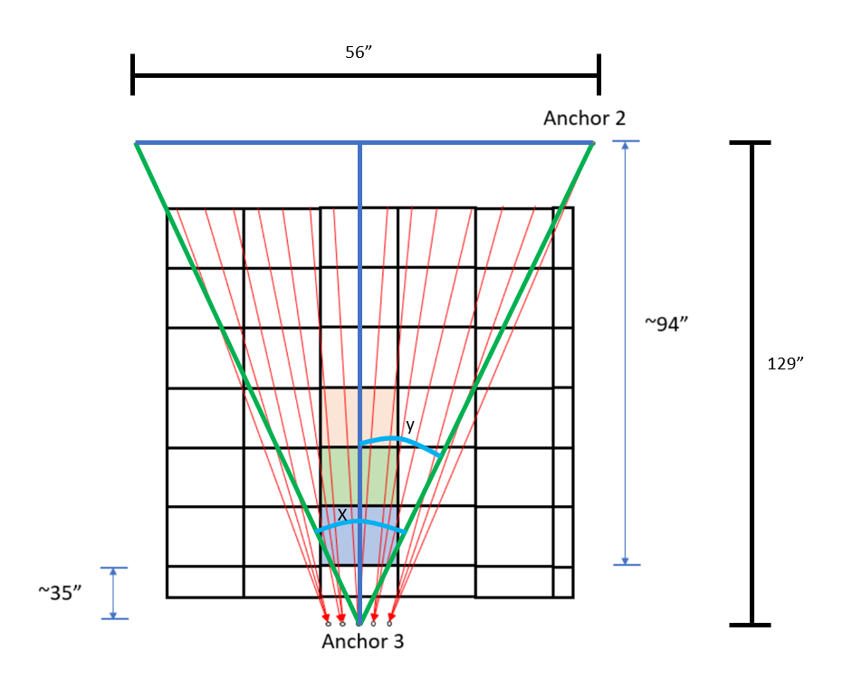

# Sensor Subsystem

## **Function:**

The goal of this subsystem is to accurately and quickly gather several data points to determine the
distance, speed, and position of the target as it slides down the fishing line.

## **Constraints:**

| No. | Constraint                                                                                              | Origin            |
| --- | ------------------------------------------------------------------------------------------------------- | ----------------- |
| 1   | The sensor shall be supplied 5 V via USB from the Jetson Nano processor                                 | System Constraint |
| 2   | The sensor shall be able to retrieve at least 2 data points within 1.95 s in order to calculate speed   | System Constraint |
| 3   | The sensor shall have a resolution great enough so that the golf ball spans multiple pixels from 6 feet | Conceptual Design |
| 4   | The sensor shall have a range of at least 6 feet                                                        | Conceptual Design |
| 5   | The sensor shall be able to detect and track a golf ball-sized object from a maximum of 6 feet          | System Constraint |
| 6   | The sensor shall have a field of view greater than 24.50°                                               | Device Constraint |

1. The sensor requires a USB connection for both data and power therefore also requiring a direct connection to the Jetson Nano processor.

2. The fastest time recorded from DEVCOM is 1.95 s for the golf ball to reach the bottom of its trajectory. Therefore, the sensor must be able to retrieve data for at least 2 positions so that speed can be calculated.
3. The sensor must have a resolution great enough so that the golf ball will span across multiple pixels for image processing to be able to discern where the golf ball is
4. The furthest point that the sensor must be able to track and detect is the starting point of each golf ball which is about 6 feet from the launcher
5. The sensor shall be able to detect and track a golf ball-sized object from a maximum of 6 feet
6. The fishing lines that the golf balls slide down extend from anchor 3, given in the rulebook, to anchor 2 at an angle of 24.50°, therefore the sensor must have a field of view larger than that in order to encompass the entirety of the starting point of each fishing line

## **Buildable Schematic**

*Figure 1: Buildable Schematic of subsystem*

## **Analysis:**

### **Field of View**

To start, the camera or sensor that will be used must have a field of view (FOV) of at least 24.50°. This was found by using the measurements of the gameboard given in the rulebook from DEVCOM.

*Figure 2: Diagram of gameboard with measurements showing the angle of outermost fishing lines*

In order to find the minimum FOV, the angle, X, needs to be calculated. X gives the maximum angle at which the fishing lines will extend from anchor point 3 to anchor point 2. The FOV needs to be wider than X in order to have every fishing line in the view of the camera.

~~~ math

arctan((56/2)/129) = 12.25° = y

~~~

~~~ math

x = 2y = 2(12.25°) = 24.50°

~~~

This angle value gives some room for error due to some missing measurements from DEVCOM however it does act as a maximum angle for the fishing lines as well as the minimum FOV of the camera. Since the camera that was chosen is the Intel RealSense D435, with a FOV of 65° with the RGB camera and a FOV of 87° with the depth-sensing cameras, it will be more than enough to encompass the entirety of the gameboard [1].

### **Placement of Camera**

According to Intel, the D435 has a minimum depth sensing range of about 28 cm or 11.02" [2]. Because of this, the camera should be mounted towards the back of the launcher so that the camera will be able to use the depth camera for the maximum amount of time. The camera should also be placed as high up within the 1' X 1' X 1' area for the launcher. Measuring from the 1/4-20 threaded mounting point on the bottom of the camera, it should be mounted 10" from the ground and 2" from the back of the launcher base. This mounting position allows for some room for the USB cable as well as the mounting bracket so that nothing exceeds the boundary of the launcher size constraint. In order to center the fishing lines in the FOV of the camera, the camera should be mounted at about a 21.64° angle from the horizontal. This angle was found using the angle of the fishing line for both variable heights. This angle points the center of the camera at a point directly 46.5" from the ground on the A-frame where anchor point 2 is. This height is in the middle of the 2 variable heights given in the DEVCOM rulebook. Using this height in combination with the camera height and distance from anchor point 2 this angle can be found. The distance from the back of the launcher to anchor 2 is shown in the image above to be 94".

~~~ math

arctan((46.5 - 10) / (94 - 2)) = 21.64°

~~~

Using this angle will allow every line to be visible within the 42° vertical FOV of the RGB camera

### **Resolution**

The RGB camera supports a maximum resolution of 1920 X 1080. With the FOV of 65° X 42° the area each pixel covers 6' away can be calculated.

FOV width

~~~ math

2 * tan(65° / 2) * (6 * 12) = 91.74

~~~

Pixel width

~~~ math

91.74 / 1920 = 0.048

~~~

FOV height

~~~ math

2 * tan(42° / 2) * (6 * 12) = 55.28

~~~

Pixel height

~~~ math

55.28 / 1080 = 0.051

~~~

Since the diameter of a golf ball is about 1.68", the RGB camera will not have a problem detecting the golf ball because, from the furthest point on the gameboard, there will be around 30 pixels covering the golf ball on both the X and Y axes.

### **Frame Rate**

The RGB camera on the D435 has a maximum frame rate of 30 fps at a resolution of 1920 X 1080. The depth camera has a maximum frame rate of 90 fps at a resolution of 1280 X 720. At these frame rates, the RGB camera will be able to sample the position every 33.33 ms, and the depth camera will be able to sample the distance every 11.11 ms.

~~~ math

1 / 30 = 0.0333333

~~~

~~~ math

1 / 90 = 0.0111111

~~~

### **Data Transfer and power**

According to the datasheet of the D435, the depth and RGB camera both use 16 bits of data for each pixel. If both of the cameras are running at maximum resolution and frame rate, then the following calculations can be made:

~~~ math

1920 * 1080 * 16 * 30 = 995,328,000

~~~

~~~ math

1280 * 720 * 16 * 90 = 1,327,104,000

~~~

~~~ math

995,328,000 + 1,327,104,000 = 2,322,432,000

~~~

This means that 2.32 Gbps is the absolute minimum data transfer rate for the D435. Data and power will both be supplied by a USB A to USB C 3.1 Gen 1 cable. This means that there will be no problem with transferring data to the Jetson Nano because the transfer rate of USB 3.1 Gen 1 is 5 Gbps.

<!--### **Illumination**-->

## **Bill of Materials:**

| Name of Item         | Description  | Used in which subsystem(s) | Part Number      | Manufacturer            | Quantity | Price      | Total   |
| -------------------- | ------------ | -------------------------- | ---------------- | ----------------------- | -------- | ---------- | ------- |
| Intel RealSense D435 | Depth Camera | Sensor                     | D435             | Intel                   | 1        | $304.07    | $304.07 |

## **References:**

[1] “Intel-Realsense-D400-Series-Datasheet.pdf,” Intel, https://www.intel.com/content/dam/support/us/en/documents/emerging-technologies/intel-realsense-technology/Intel-RealSense-D400-Series-Datasheet.pdf (accessed Apr. 17, 2024). 

[2] “Depth camera d435i,” Intel® RealSenseTM Depth and Tracking Cameras, https://www.intelrealsense.com/depth-camera-d435i/ (accessed Apr. 17, 2024). 
