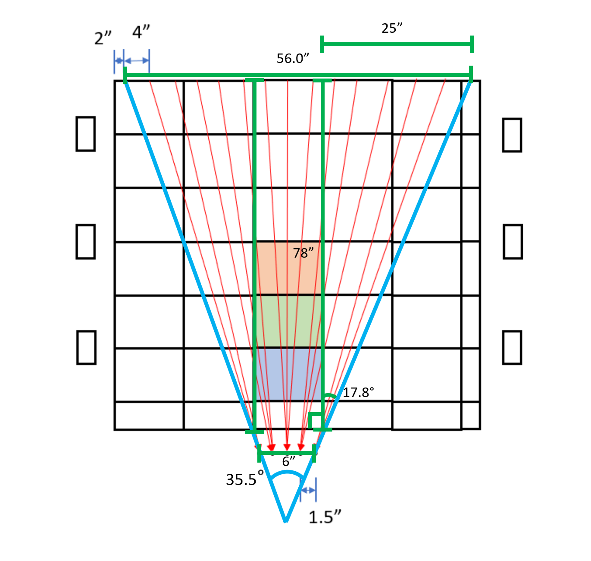

# Sensor Subsystem

## **Function:**

The goal of this subsystem is to accurately and quickly gather several data points to determine the
distance, speed, and position of the target as it slides down the fishing line.

## **Constraints:**

| No. | Constraint                                                                                                                                     | Origin            |
|-----|------------------------------------------------------------------------------------------------------------------------------------------------|-------------------|
| 1   | The sensor shall be supplied 5 V via USB from the Jetson Nano processor                                                                        | System Constraint |
| 2   | The sensor shall be able to retrieve at least 2 data points within 1.95 s in order to calculate speed                                          | System Constraint |
| 3   | SOMETHING ABOUT RESOLUTION AND LINE DETECTION | Conceptual Design |
| 4   | The sensor shall have a range of at least 6 feet                                                                                               | Conceptual Design |
| 5   | The sensor shall be able to detect and track a golf ball-sized object from a maximum of 6 feet                                                 | System Constraint |
| 6   | The sensor shall have a field of view greater than 35.54°                                                                                       | Device Constraint |

1. The sensor requires a USB connection for both data and power therefore also requiring a direct connection to the Jetson Nano processor.

2. The fastest time recorded from DEVCOM is 1.95 s for the golf ball to reach the bottom of its trajectory. Therefore, the sensor must be able to retrieve data for at least 2 positions so that speed can be calculated.
3. The sensor must have a resolution great enough to be able to distinguish NOT FINISHED HERE!!!!!!!!!!!!!!!!!!!!!!!!!!!!!!!!!!!!!!!!!!!!!!!!!!!!!!!!!
4. The furthest point that the sensor must be able to track and detect is the starting point of each golf ball which is about 6 feet from the launcher
5. The sensor shall be able to detect and track a golf ball-sized object from a maximum of 6 feet
6. The fishing lines that the golf balls slide down extend from anchor 3, given in the rulebook, to anchor 2 at an angle of 35.54°, therefore the sensor must have a field of view larger than that in order to encompass the entirety of the starting point of each fishing line

## **Buildable Schematic**

## **Analysis:**

### **Field of View**

To start off, the camera or sensor that will be used must have a field of view (FOV) of at least 35.54°. This was found by using the measurements of the gameboard given in the rulebook from DEVCOM.

Breaking down the triangle created from the fishing lines from Anchor 3 to Anchor 2 gives 3 smaller triangles and a rectangle with known sides. From this, a calculation can be made to find an angle that helps find one of the angles of the isosceles triangle at anchor 3.

~~~ math

arctan(25/78) = 17.77°

~~~

~~~ math

180° - (17.77° + 90°) = 72.23°

~~~

This angle can now be used to find the minimum FOV of the camera.

~~~ math

180° - (72.23° * 2) = 35.54°

~~~

This angle value gives some room for error due to some missing measurements from DEVCOM however it does act as a maximum angle for the fishing lines as well as the minimum FOV of the camera. Since the camera that was chosen is the Intel RealSense D435, with a FOV of 65° with the RGB camera and a FOV of 87° with the depth-sensing cameras, it will be more than enough to encompass the entirety of the gameboard [1].

### **Placement of Camera**

According to Intel, the D435 has a minimum depth sensing range of about 28 cm or 11.02 in [2].

### **Frame Rate**

### **Data Transfer**

## **Bill of Materials:**

| Device               | Quantity | Price   | Total   |
| -------------------- | -------- | ------- | ------- |
| Intel RealSense D435 | 1        | $304.07 | $304.07 |

## **References:**

[1] “Intel-Realsense-D400-Series-Datasheet.pdf,” Intel, https://www.intel.com/content/dam/support/us/en/documents/emerging-technologies/intel-realsense-technology/Intel-RealSense-D400-Series-Datasheet.pdf (accessed Apr. 17, 2024). 

[2] “Depth camera d435i,” Intel® RealSenseTM Depth and Tracking Cameras, https://www.intelrealsense.com/depth-camera-d435i/ (accessed Apr. 17, 2024). 
