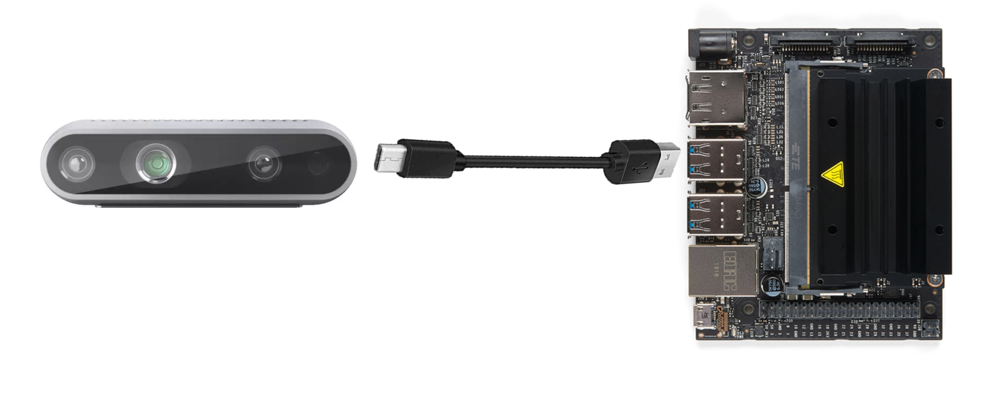

# Sensor Subsystem

## **Function:**

The goal of this subsystem is to accurately and quickly gather several data points to determine the
distance, speed, and position of the target as it slides down the fishing line.

## **Constraints:**

| No. | Constraint                                                                                                                                                                                                  | Origin            |
| --- | ----------------------------------------------------------------------------------------------------------------------------------------------------------------------------------------------------------- | ----------------- |
| 1   | The sensor shall be supplied 5 V via USB from the Jetson Nano processor                                                                                                                                     | System Constraint |
| 2   | The sensor shall be able to retrieve at least 2 data points within 0.0667s in order to calculate speed which allows for maximum time for calculations given the constraints of the image processing system  | System Constraint |
| 3   | The sensor shall have a resolution no larger than 1920 X 1080 due to constraints from the image processing system                                                                                           | Conceptual Design |
| 4   | The sensor shall be able to gather depth data from at least 6' away which is the length of the gameboard                                                                                                    | Conceptual Design |
| 5   | The sensor shall have a FOV that is wider than 56" from 6' away which is the width of anchor 2 and the length of the gameboard                                                                              | Device Constraint |

1. The sensor requires a USB connection for both data and power therefore it also requires a direct connection to the Jetson Nano processor
2. The frame rate must be fast enough to get 2 frames of data within 0.0667s or about 30 fps. Because this is the maximum frame rate for the image processing system
3. The sensor shall have a maximum resolution of 1920 X 1080 due to the speed and processing power of the image processing subsystem
4. The depth camera should be able to get the distance of an object from at least 6' away which is the length of the gameboard
5. Since the width of anchor 2 from the DEVCOM rulebook is 56", the FOV must be wider than 56" at 6' away in order to encompass all the fishing lines

## **Buildable Schematic**

*Figure 1: Buildable Schematic of subsystem*

## **Analysis:**

### **Placement of Camera**

According to Intel, the D435 has a minimum depth sensing range of about 28 cm or 11.02" [2]. Because of this, the camera should be mounted towards the back of the launcher so that the camera will be able to use the depth camera for the maximum amount of time. The camera should also be placed as high up within the 1' X 1' X 1' area for the launcher. Measuring from the 1/4-20 threaded mounting point on the bottom of the camera, it should be mounted 10" from the ground and 2" from the back of the launcher base. This mounting position allows for some room for the USB cable as well as the mounting bracket so that nothing exceeds the boundary of the launcher size constraint. In order to center the fishing lines in the FOV of the camera, the camera should be mounted at about a 21.64° angle from the horizontal. This angle was found using the angle of the fishing line for both variable heights. This angle points the center of the camera at a point directly 46.5" from the ground on the A-frame where anchor point 2 is. This height is in the middle of the 2 variable heights given in the DEVCOM rulebook. Using this height in combination with the camera height and distance from anchor point 2 this angle can be found. The distance from the back of the launcher to anchor 2 is shown in the image above to be 94".

~~~ math

arctan((46.5 - 10) / (94 - 2)) = 21.64°

~~~

The numbers used in this calculation are based on the distance from the back of the launcher to anchor point 2 (94"), the distance from the back of the launcher to the camera (2"), the middle point between the 2 variable heights (46.5"), and the height of the camera (10"). Using this angle will allow every line to be visible within the 42° vertical FOV of the RGB camera

### **Resolution**

The RGB camera supports a maximum resolution of 1920 X 1080. With the FOV of 69° X 42° the area each pixel covers 6' away can be calculated.

FOV width

~~~ math

2 * tan(69° / 2) * (6 * 12) = 98.97

~~~

Pixel width

~~~ math

98.97 / 1920 = 0.052

~~~

FOV height

~~~ math

2 * tan(42° / 2) * (6 * 12) = 55.28

~~~

Pixel height

~~~ math

55.28 / 1080 = 0.051

~~~

Since the diameter of a golf ball is about 1.68", the RGB camera will not have a problem detecting the golf ball because, from the furthest point on the gameboard, there will be around 30 pixels covering the golf ball on both the X and Y axes.

### **Field of View**

Based on the math provided in the above resolution section, it is known that the FOV of the camera is 98.97" at 6' away. Therefore, the FOV of the camera will be more than wide enough to encompass each fishing line because the width between the 2 furthest lines is 56".

### **Frame Rate**

The RGB camera on the D435 has a maximum frame rate of 30 fps at a resolution of 1920 X 1080. The depth camera has a maximum frame rate of 90 fps at a resolution of 1280 X 720. At these frame rates, the RGB camera will be able to sample the position every 33.33 ms, and the depth camera will be able to sample the distance every 11.11 ms.

~~~ math

1 / 30 = 0.0333333

~~~

~~~ math

1 / 90 = 0.0111111

~~~

### **Data Transfer and power**

According to the datasheet of the D435, the depth and RGB camera both use 16 bits of data for each pixel. If both of the cameras are running at maximum resolution and frame rate, then the following calculations can be made:

~~~ math

1920 * 1080 * 16 * 30 = 995,328,000

~~~

~~~ math

1280 * 720 * 16 * 90 = 1,327,104,000

~~~

~~~ math

995,328,000 + 1,327,104,000 = 2,322,432,000

~~~

This means that 2.32 Gbps is the absolute minimum data transfer rate for the D435. Data and power will both be supplied by a USB A to USB C 3.1 Gen 1 cable. This means that there will be no problem with transferring data to the Jetson Nano because the transfer rate of USB 3.1 Gen 1 is 5 Gbps.

<!--### **Illumination**-->

## **Bill of Materials:**

| Name of Item         | Description  | Used in which subsystem(s) | Part Number      | Manufacturer            | Quantity | Price      | Total   |
| -------------------- | ------------ | -------------------------- | ---------------- | ----------------------- | -------- | ---------- | ------- |
| Intel RealSense D435 | Depth Camera | Sensor                     | D435             | Intel                   | 1        | $304.07    | $304.07 |

## **References:**

[1] “Intel-Realsense-D400-Series-Datasheet.pdf,” Intel, https://www.intel.com/content/dam/support/us/en/documents/emerging-technologies/intel-realsense-technology/Intel-RealSense-D400-Series-Datasheet.pdf (accessed Apr. 17, 2024). 

[2] “Depth camera d435i,” Intel® RealSenseTM Depth and Tracking Cameras, https://www.intelrealsense.com/depth-camera-d435i/ (accessed Apr. 17, 2024). 
