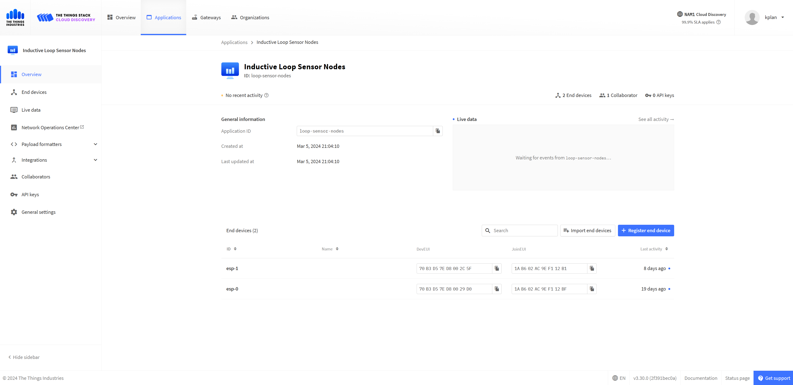

# Using The Things Stack Application

## Information
This is where all the gateways and end devices for the LoRaWAN will be registered. All the messaging data is captured here. You can also make integrations with other services like Firebase for the mobile app.

## Link to Application
Here is a link to get to The Things Stack Application: https://parking-lot-loops.nam1.cloud.thethings.industries/console/applications/loop-sensor-nodes

## Getting Access
If you want to continue working on this project, you may want access to this application. I have the email and password that owns the plan with The Things Industries. Even though it is free, it is tied to my personal credit card so I cannot give you that email and password. Instead, I can add you as admin if you contact me at kyleplant4593@gmail.com. 

Alternatively, you can set it all up yourself. Refer to https://www.thethingsindustries.com/docs/the-things-stack/ for help setting it all up yourself. You will need to register the gateway and ESP32s again as well.

*This is what the application looks like*